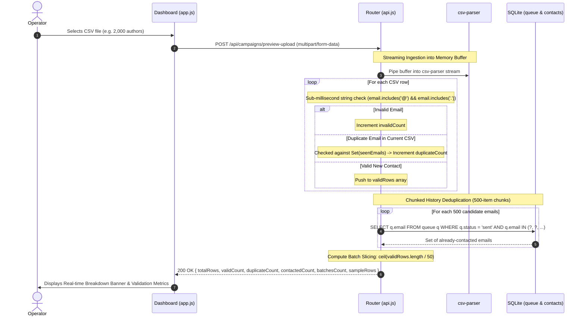
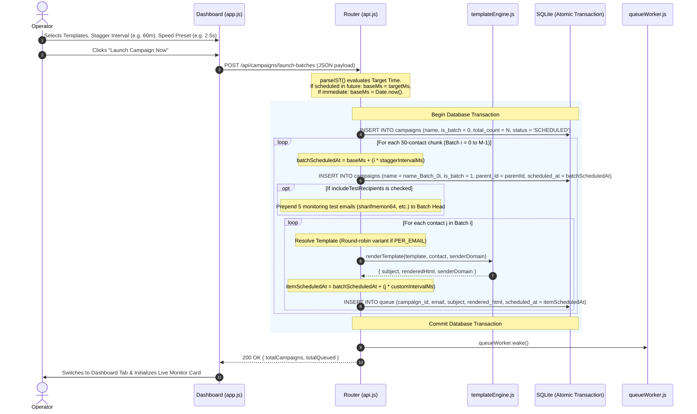
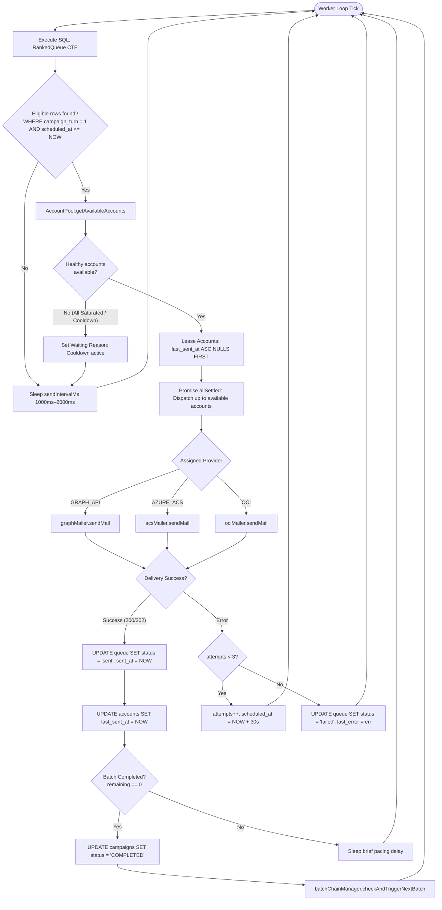
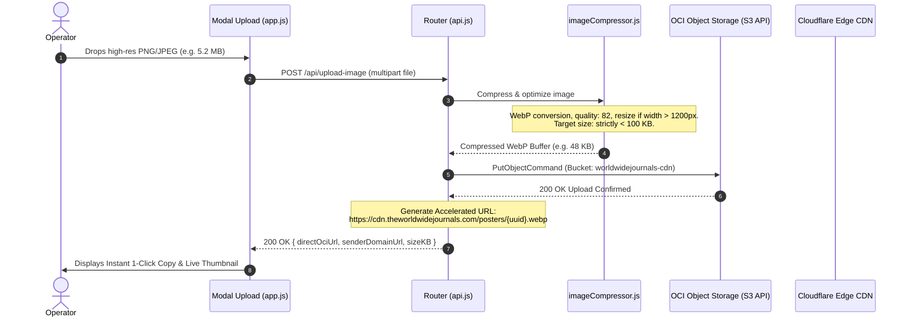

# 🌐 Technical Specification: End-to-End Request Processing Lifecycle & System Architecture

**Target System:** `azure-graph-mailer`  
**Author:** Antigravity Engineering  
**Status:** PRODUCTION IMPLEMENTED & DEPLOYED  
**Date:** September 28, 2026  
**Audience:** Core Engineers, System Architects & Operations Teams  

---

## 1. System Topology & Architectural Layers

The **Azure Graph Mailer** is an industrial-grade, multi-provider email automation and deliverability engine designed to orchestrate high-throughput academic call-for-papers across **Microsoft Graph API**, **Azure Communication Services (ACS)**, and **Oracle Cloud Infrastructure (OCI)**.

The system is decoupled into six distinct architectural layers:

```
┌─────────────────────────────────────────────────────────────────────────────┐
│ 1. PRESENTATION LAYER (Browser Client)                                      │
│ • Single-Page Dashboard (public/index.html)                                 │
│ • Whitish-Slate Light Design System (public/css/style.css)                  │
│ • Client Orchestrator (public/js/app.js & batchChainUI.js)                  │
│ • Slide-Over Inspection Drawer & Real-Time Telemetry Poller (3s interval)   │
└──────────────────────────────────────┬──────────────────────────────────────┘
                                       │ HTTP / REST APIs (JSON / Multipart)
┌──────────────────────────────────────▼──────────────────────────────────────┐
│ 2. ROUTING & CONTROLLER LAYER (Express Server / src/app.js)                 │
│ • Static Assets with Version Cache-Buster (?v=timestamp)                   │
│ • Zero-Trust Admin API Key Middleware                                       │
│ • Core Router (src/routes/api.js) & Batch Router (src/routes/batchChain.js) │
└───────────────────┬──────────────────────────────────────┬──────────────────┘
                    │                                      │
┌───────────────────▼──────────────────┐ ┌─────────────────▼──────────────────┐
│ 3. BUSINESS LOGIC & PIPELINES        │ │ 4. DATABASE & PERSISTENCE LAYER    │
│ • Lead Parsing & History Deduplication│ │ • SQLite 3 with WAL Mode (src/db)  │
│ • Batch Division & Test Email Inject │ │ • Compound B-Tree Indexes          │
│ • Dynamic Link & Template Engine     │ │ • Master Campaigns (is_batch = 0)  │
│ • Smart Pool Quotas & Cooldowns      │ │ • Child Batches (is_batch = 1)     │
│ • Sharp WebP Image Compression (<100KB│ │ • Queue Records & Audit Logs       │
└───────────────────┬──────────────────┘ └─────────────────▲──────────────────┘
                    │                                      │
┌───────────────────▼──────────────────────────────────────┴──────────────────┐
│ 5. BACKGROUND EXECUTION LAYER (src/services/queueWorker.js)                 │
│ • 24/7 Priority Queue Loop (1000ms–2000ms normal / 100ms instant send)      │
│ • Window Function CTE (RankedQueue with campaign_turn = 1 Pacing Guard)     │
│ • Smart Pool Fair Account Leasing (last_sent_at ASC NULLS FIRST)            │
│ • Stranded Email Rescue & Batch-Chaining Completion Watchdogs                │
└──────────────────────────────────────┬──────────────────────────────────────┘
                                       │ Outbound Protocols (REST / SMTP)
┌──────────────────────────────────────▼──────────────────────────────────────┐
│ 6. CLOUD TRANSPORT & DELIVERY LAYER                                         │
│ ┌──────────────────────┬──────────────────────┬───────────────────────────┐ │
│ │ Microsoft Graph API  │ Azure ACS Email      │ Oracle OCI SMTP Relay     │ │
│ │ (Mail.Send OAuth2)   │ (EmailClient SDK)    │ (Port 587 STARTTLS)       │ │
│ └──────────────────────┴──────────────────────┴───────────────────────────┘ │
└─────────────────────────────────────────────────────────────────────────────┘
```

---

## 2. Request Lifecycle 1: Lead Ingestion, Parsing & Deduplication

**Endpoint:** `POST /api/campaigns/preview-upload`  
**Purpose:** Pre-flight validation, deduplication against past sent campaigns, and dynamic batch slicing before database insertion.



### Algorithmic Highlights:
1. **$O(L)$ Fast String Scanning:** Avoids catastrophic regular expression backtracking on complex author names or corrupted emails.
2. **Chunked SQLite B-Tree Querying:** Contacts are checked in slices of 500 against index `idx_queue_email_status` (`queue(email, status)`), executing in **< 40ms** for 2,000 contacts.

---

## 3. Request Lifecycle 2: Campaign Batching, Template Rotation & Scheduling

**Endpoint:** `POST /api/campaigns/launch-batches`  
**Purpose:** Atomically creates the parent campaign hierarchy, child batches, injects monitoring test inboxes, resolves template variants, and staggers queue timestamps.



### Mathematical Scheduling Formulas:
1. **Batch Staggering:**
   $$\text{batchScheduledAt}_i = \text{baseMs} + (i \times \text{batchStaggerIntervalMinutes} \times 60{,}000)$$
2. **Granular Recipient Pacing:**
   $$\text{itemScheduledAt}_{i, j} = \text{batchScheduledAt}_i + (j \times \text{customIntervalMs})$$
   * Recipient #1: Eligible at $\text{batchScheduledAt}_i + 0\text{s}$
   * Recipient #2: Eligible at $\text{batchScheduledAt}_i + 2.5\text{s}$
   * Recipient #3: Eligible at $\text{batchScheduledAt}_i + 5.0\text{s}$

---

## 4. Request Lifecycle 3: The 24/7 Queue Worker Dispatch Engine

**Engine File:** `src/services/queueWorker.js`  
**Loop Mechanism:** Autonomous continuous loop with interruptible sleep timers (`interruptibleSleep()`).



### The Window Function Pacing Guard:
To guarantee that high-speed multi-account pools rotate sequentially 1-by-1 instead of bursting simultaneously, the queue engine executes:

```sql
WITH RankedQueue AS (
  SELECT q.*, c.name AS campaign_name, c.status AS campaign_status,
         c.mode AS campaign_mode,
         COALESCE(c.pinned_account_id, c.sender_account_id) AS campaign_pinned_account_id,
         c.fallback_allowed AS campaign_fallback_allowed,
         c.custom_interval_ms AS campaign_custom_interval_ms,
         ROW_NUMBER() OVER (PARTITION BY q.campaign_id ORDER BY q.scheduled_at ASC, q.id ASC) AS campaign_turn
  FROM queue q
  JOIN campaigns c ON q.campaign_id = c.id
  WHERE q.status = 'queued'
    AND (q.scheduled_at IS NULL OR q.scheduled_at <= datetime('now', '+330 minutes'))
    AND c.status IN ('SCHEDULED', 'QUEUED', 'RUNNING')
)
SELECT * FROM RankedQueue
WHERE (campaign_turn = 1 OR campaign_id IN (:priorityIds))
ORDER BY 
  CASE 
    WHEN campaign_id IN (:priorityIds) THEN 0 
    WHEN campaign_status = 'RUNNING' THEN 1 
    ELSE 2 
  END ASC,
  CASE WHEN scheduled_at IS NULL THEN 0 ELSE 1 END ASC,
  scheduled_at ASC,
  id ASC
LIMIT :concurrency;
```

---

## 5. Request Lifecycle 4: Multi-Provider Transport Drivers

| Driver | File | Mechanism | Timeout Guard | Concurrency |
| :--- | :--- | :--- | :--- | :--- |
| **Microsoft Graph** | `src/services/graphMailer.js` | REST API `POST /v1.0/users/{email}/sendMail` with App Secret OAuth2 token caching | `15,000ms` `AbortController` | 30 msgs/min per mailbox |
| **Azure ACS** | `src/services/acsMailer.js` | Azure Cloud SDK (`@azure/communication-email`) Poller | `5,000ms` `Promise.race` polling guard | 100 msgs/sec throughput |
| **Oracle OCI** | `src/services/ociMailer.js` | Native SMTP Relay on Port 587 (`nodemailer`) with TLS STARTTLS | `15,000ms` socket timeout | 50 msgs/sec |
| **Mailgun** | `src/services/mailgunMailer.js` | Mailgun REST API v3 via HTTP/2 | `10,000ms` axios timeout | 100 msgs/sec |

---

## 6. Request Lifecycle 5: Real-Time Telemetry & Inspection Drawer

**Endpoint:** `GET /api/campaigns/active-monitor` (Polled every 3 seconds by `public/js/app.js`)

```
[Browser Dashboard] ──(Every 3s)──► [GET /api/campaigns/active-monitor]
                                            │
         ┌──────────────────────────────────┴──────────────────────────────────┐
         ▼                                                                     ▼
[Active Running Campaign]                                             [Scheduled Queue Timeline]
• Total, Sent, Failed counts                                          • List of upcoming child batches
• Dynamic Completion ETA Math:                                        • Formatted IST target timestamps
  remaining = total - sent - failed                                   • Time-until countdowns ("in 45m")
  ETA = Date.now() + (remaining * pacingMs)                           • 1-Click Cancel scheduled batch
• Operational Diagnostic Reason:
  - If waiting: shows seconds until next account cooldown
  - Next available account name in Smart Pool
```

### Inspection Drawer Concurrency Safety:
When an operator clicks **"Inspect"** on any campaign, `app.js` sets:
```javascript
isInspectDrawerOpen = true;
```
This pauses background DOM re-renders of the main pipeline table while the drawer is open. This eliminates CPU layout thrashing, scroll jump bugs, and race conditions during high-speed dispatches.

---

## 7. Request Lifecycle 6: Cloudflare Edge CDN Creative Hosting

**Endpoint:** `POST /api/upload-image`  
**Purpose:** Uploads author flyers or journal posters, compresses them to WebP under 100KB, uploads to OCI Object Storage, and serves via Cloudflare Global Edge.



---

## 8. Resilience, Recovery & Error Handling

1. **Stranded Queue Item Watchdog:**
   Every 30 seconds, `queueWorker.js` executes:
   ```sql
   UPDATE queue 
   SET status = 'queued', account_id = NULL, scheduled_at = datetime('now', '+330 minutes') 
   WHERE status = 'sending' 
     AND started_at <= datetime('now', '+330 minutes', '-5 minutes');
   ```
   If a Node.js process crashes or PM2 restarts mid-flight, emails stuck in `sending` status are safely rescued and re-queued.

2. **Automatic 24h Quota Rolling Reset:**
   Account quotas are calculated dynamically against actual dispatches:
   ```sql
   SELECT COUNT(*) AS sent_today 
   FROM queue 
   WHERE account_id = ? 
     AND status = 'sent' 
     AND sent_at >= datetime('now', '+330 minutes', '-24 hours');
   ```
   Counters recover naturally on a sliding 24-hour window without needing brittle midnight cron jobs.

3. **Suppression List Persistence:**
   When an admin deletes an account from the dashboard, its email address is appended to the persistent JSON setting `suppressed_accounts`. When the application restarts, `seedDefaultAccount()` checks this list and guarantees deleted accounts are never revived.

---

## 🔗 Related Notes (Obsidian Links)
* [[UI_DESIGN_SYSTEM_AND_LIGHT_THEME_SPECIFICATION]]
* [[SPEC_PRODUCTION_CAMPAIGN_SCHEDULER]]
* [[ALGORITHM_TIMING_SCHEDULING_AND_WORKERS_DSA]]
* [[CLOUDFLARE_CDN_EDGE_IMAGE_DELIVERY_SOP]]
* [[INCIDENT_REPORT_DISPATCH_PACING_PARALLEL_BURST_AND_RECIPIENT_STAGGER]]
* [[ARCHITECTURE_AND_SYSTEM_DESIGN]]
* [[README]]
