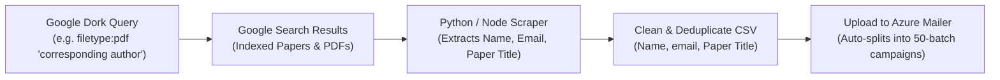

# 🎯 Executive Comparison: Graph API vs Azure ACS & Google Dorking Lead Intelligence

---

## ⚖️ Part 1: Truth & Comparison: Microsoft Graph API vs Azure ACS

| Evaluation Factor | Microsoft Graph API (M365 Exchange) | Azure Communication Services (ACS) |
| :--- | :--- | :--- |
| **Primary Design Goal** | Personal 1-to-1 business correspondence | High-volume transactional & bulk outreach |
| **Sending Speed** | Hard-capped at **30 msgs/min** per mailbox | **Tens of thousands per hour** (High-throughput) |
| **Daily Volume Limit** | **10,000 recipients/day** (sliding 24h window) | **Pay-As-You-Go** (Scale to 100k+ with quota) |
| **Cost Structure** | Included in M365 Business license (~₹900/mo) | **$0.00025/email** (~₹20 per 1,000 emails) |
| **Inbox Placement** | **Top tier** (90-95%+ primary inbox) | **Good** (depends on SPF/DKIM/DMARC domain warmup) |
| **New Tenant Risk** | 🛑 **Error `550 5.7.708`** on new/trial tenants | 🟢 **Zero IP blocks** (uses dedicated Azure MTA pool) |
| **Multi-Account Scaling** | Free Shared Mailboxes rotated across pool | Multiple sender aliases under verified domain |
| **Best Used For** | Personalized cold outreach, targeted authors | High-scale call for papers, bulk journal blasts |

### 💡 The Verdict & Dual-Engine Strategy:
1. **Use ACS Now (or for High-Volume)**: Because your M365 tenant hit the `550 5.7.708` perimeter block (until Microsoft Support unblocks the IP), **ACS sends immediately with zero errors** through your verified domain `mail.theparipexjournal.com`.
2. **Use Graph API for VIP/Targeted Batches**: Once Microsoft Support lifts the exception hold, use Graph API for small, high-touch batches (30–50 emails/day) to get 100% human-like delivery.
3. **The Web Dashboard automatically routes to either** depending on which email you pick.

---

## 🔍 Part 2: Google Dorking Intelligence for Finding Academic Author Leads

Academic papers index corresponding authors, contact details, affiliations, and paper titles on Google. You can use these operators to build target contact lists:

### 1. High-Yield Google Dorks for Author Emails

| Target Lead Type | Exact Google Dork Query |
| :--- | :--- |
| **Medical / Clinical Authors** | `filetype:pdf "corresponding author" "email" "gmail.com" "clinical"` |
| **Engineering & Tech Papers** | `filetype:pdf "correspondence to" "@gmail.com" "Department of Computer Science"` |
| **Targeting Indian Universities** | `site:ac.in filetype:pdf "corresponding author" "email:" "research paper"` |
| **Targeting US / Global Edu** | `site:.edu filetype:pdf "to whom correspondence should be addressed" "email"` |
| **Direct Author Excel/CSV Leads** | `filetype:xlsx OR filetype:csv "author email" "paper title" OR "manuscript"` |
| **Call for Papers Submissions** | `intitle:"list of accepted papers" intext:"author" intext:"@"` |
| **Conference Proceedings** | `filetype:pdf "Conference on" "email:" intext:"university"` |

### 2. Scraping Workflow (Google Dork to CSV)

