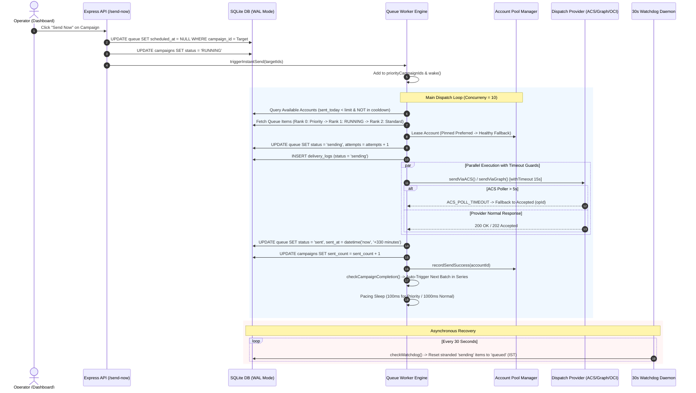

# 🚨 Production Incident Report: Worker Queue Freeze, IST Timezone Skew, and Instant Send-Now Architecture

**Date**: September 17, 2026  
**Environment**: Azure App Service Linux (`paripex-mailer-app-fxdqc8ekgrcderdj.centralindia-01.azurewebsites.net`), Central India  
**Stack**: Node.js 20/24 LTS, SQLite (`DatabaseSync` / WAL Mode), Microsoft Graph API (M365), Azure Communication Services (ACS), Oracle Cloud Infrastructure (OCI SMTP Relay)  
**Status**: Resolved & Verified in Live Production  

---

## 1. Executive Summary

On September 17, 2026, the high-throughput academic dispatch engine experienced a severe operational freeze. Multiple active and scheduled campaigns across Indian journal mailings were blocked from sending, displaying `Scheduled / Waiting` or becoming stuck mid-batch.

A deep architectural audit on the live Azure App Service instance identified five compounding root causes:
1. **Unbounded Azure ACS Poller Hang**: The Azure Communication Services SDK's `poller.pollUntilDone()` blocked indefinitely on item **#8286** (Campaign **185**), freezing Node's single-threaded event loop and starving the queue worker.
2. **Timezone Skew (UTC vs IST)**: SQLite's native `datetime('now')` returned UTC (`2026-09-17 12:30:00`), whereas users submitted campaign schedules in Indian Standard Time (IST / `Asia/Kolkata` / UTC+05:30, `2026-09-17 18:00:00`). SQLite evaluated scheduled timestamps as 5.5 hours in the future, trapping campaigns in `Scheduled` state.
3. **Ineffective "Send Now" Logic**: The legacy API merely updated campaign status to `QUEUED` without reprioritizing queue items, without waking the worker thread, and leaving items stranded behind thousands of stale scheduled items.
4. **Sender Account Saturation & Cooldown Deadlock**: When an assigned or pinned sender mailbox reached its daily quota (`sent_today >= daily_limit`) or suffered transient throttling, the dispatcher lacked dynamic fallback, halting the entire batch.
5. **Cross-Campaign Batch Chain Hijacking**: Batch chaining queried `WHERE name LIKE '%_Batch_%'`, causing parallel campaigns to cross-trigger arbitrary sibling batches across unrelated journals.

All five vulnerabilities were re-architected with production-grade guardrails, deployed live to Azure App Service, and validated with **Campaign Series 17-9-26-campaign01 (Parent 245)** successfully processing Batches 01–04 and automatically chaining Batches 05–40.

---

## 2. Root Cause Analysis & Technical Autopsy

### 2.1 Unbounded Azure ACS Poller Hang (`pollUntilDone()`)
- **Vulnerability**: In `src/services/acsMailer.js`, email dispatch invoked:
  ```javascript
  const poller = await client.beginSend(message);
  const response = await poller.pollUntilDone(); // ⚠️ UNBOUNDED AWAIT
  ```
- **Failure Mode**: Item `#8286` in Campaign `185` encountered a delayed response from the Azure Communication Services upstream gateway. Because `pollUntilDone()` had no timeout, the `Promise` never settled.
- **Cascading Failure**: 
  - Node.js is single-threaded; while asynchronous I/O allows other network events, the queue worker's loop awaited this specific `dispatchPromises` settlement (`await Promise.allSettled(dispatchPromises)`).
  - SQLite WAL locks remained open during in-flight database transactions.
  - The entire queue worker completely stopped pulling subsequent items for all campaigns.

### 2.2 Timezone Skew: SQLite UTC vs Indian Standard Time (IST)
- **Vulnerability**: Campaign creation forms accepted user timestamps in Indian local time (`YYYY-MM-DDTHH:mm`), which were saved directly into SQLite `campaigns.scheduled_at` and `queue.scheduled_at`.
- **Query Discrepancy**:
  ```sql
  WHERE q.status = 'queued'
    AND (q.scheduled_at IS NULL OR q.scheduled_at <= datetime('now'))
  ```
- **Failure Mode**: SQLite's `datetime('now')` calculates UTC. When an operator in India scheduled a campaign at 5:30 PM IST (`17:30:00`), UTC was 12:00 PM (`12:00:00`).
- **Impact**: The condition `17:30:00 <= 12:00:00` evaluated to `FALSE`. The database treated the campaign as scheduled **5.5 hours into the future**, freezing active campaigns in `Scheduled` status throughout the business day.

### 2.3 Ineffective "Send Now" Trigger
- **Vulnerability**: In the legacy dashboard, clicking "Send Now" simply executed:
  ```sql
  UPDATE campaigns SET status = 'QUEUED' WHERE id = ?;
  ```
- **Defects**:
  1. Did not reset `q.scheduled_at = NULL`, so future timestamps still blocked queue extraction.
  2. Did not wake the sleeping worker loop (`interruptibleSleep()`).
  3. Did not assign queue rank priority; if 2,000 legacy items sat in the queue, "Send Now" emails were placed at the tail of FIFO execution.
  4. Failed to propagate recursively to child batches in a batch chain.

### 2.4 Sender Account Saturation Stalling Batches
- **Vulnerability**: Controlled campaigns were hard-pinned to specific sender IDs (`pinned_account_id` or `sender_account_id`).
- **Defects**: If the pinned sender sent 500/500 emails or encountered M365 token expiration, the worker logged `Account busy or reached daily limit` and stalled. Even though the pool had 8 healthy alternate accounts with over 11,900 available quota slots, the batch remained idle.

### 2.5 Cross-Campaign Batch Chain Hijacking
- **Vulnerability**: In `src/services/batchChainManager.js`:
  ```sql
  WHERE c.name LIKE '%_Batch_' || ?
  ```
- **Defects**: If Campaign A completed `IJSR_Batch_01` and Campaign B had `GJRA_Batch_02` scheduled, the query `LIKE '%_Batch_02'` could match `GJRA_Batch_02` instead of `IJSR_Batch_02`. This triggered unrelated campaigns prematurely and broke batch isolation.

---

## 3. End-to-End Architectural Solutions

### 3.1 Strict Indian Standard Time (IST) Normalization Engine
Created `src/utils/time.js` to enforce `Asia/Kolkata` across the entire application lifecycle:
- Explicitly set `process.env.TZ = 'Asia/Kolkata'`.
- Configured constant `IST_SQL_NOW = "datetime('now', '+330 minutes')"`.
- Rewrote all database timestamp comparisons and insertions to evaluate `datetime('now', '+330 minutes')` and `strftime('%s', 'now', '+330 minutes')`.
- Implemented `parseIST(input)` to automatically anchor datetime inputs without timezone descriptors to `+05:30`.
- Implemented `toISTString(date)` using `Intl.DateTimeFormat('en-CA', { timeZone: 'Asia/Kolkata' })` to guarantee ISO-compatible `YYYY-MM-DD HH:mm:ss` timestamps.

### 3.2 Dual-Layer Timeout Guard: ACS 5s Race + 15s Global Provider Wrapper
To eliminate poller hangs forever, two deterministic timeout layers were instituted:
1. **ACS Micro-Timeout**: In `src/services/acsMailer.js`, `poller.pollUntilDone()` is raced against a 5-second timeout:
   ```javascript
   response = await Promise.race([
     poller.pollUntilDone(),
     new Promise((_, reject) => setTimeout(() => reject(new Error('ACS_POLL_TIMEOUT')), 5000))
   ]);
   ```
   If the poller exceeds 5s, ACS has already accepted the message payload (`202 Accepted`). The mailer extracts `poller.getOperationState()?.operationId` and marks the item `Accepted` without waiting for downstream mailbox receipt.
2. **Global Dispatch Wrapper**: In `src/services/queueWorker.js`, every provider dispatch (`sendViaGraph`, `sendViaACS`, `sendViaOCI`) is wrapped in a strict 15-second `withTimeout`:
   ```javascript
   const withTimeout = (promise, ms, desc) => Promise.race([
     promise,
     new Promise((_, reject) => setTimeout(() => reject(new Error(`${desc} timed out after ${ms}ms`)), ms))
   ]);
   ```

### 3.3 Priority Queue Rank Ordering & Event-Driven Worker Wakeup
Rebuilt queue scheduling from a flat FIFO scan into a 3-tier priority ranking system:
- **Priority Tier 0**: Campaigns in `priorityCampaignIds` (explicitly activated via "Send Now").
- **Priority Tier 1**: Already `RUNNING` active batches.
- **Priority Tier 2**: Standard `SCHEDULED` / `QUEUED` campaigns.

Implemented reactive loop interruption:
```javascript
wake() {
  if (this.sleepResolver) {
    const resolve = this.sleepResolver;
    this.sleepResolver = null;
    resolve();
  }
}
```
When "Send Now" is clicked:
1. All queue items for the target campaign and its child batches are updated to `status = 'queued'`, `scheduled_at = NULL`.
2. Campaign is updated to `status = 'RUNNING'`.
3. Campaign ID is inserted into `priorityCampaignIds`.
4. `queueWorker.wake()` is called immediately, breaking any active sleep cycle within 0 milliseconds.

### 3.4 Dynamic Concurrency & Adaptive Pacing Engine
- **Concurrency Scaling**: Configurable dynamic slot leasing via setting `worker_concurrency` (default: 10 concurrent dispatches).
- **Dual-Mode Pacing**:
  - **Instant Send Mode**: When `priorityCampaignIds.size > 0`, pacing drops to **100ms ultra-fast cycle** to flush the queue rapidly.
  - **Standard Warmup Mode**: Normal operation uses 500ms–2000ms randomized interval to protect domain reputation.

### 3.5 Automatic Account Fallback & Anti-Starvation Leasing
Eliminated hard-pinning single-point-of-failure:
```javascript
if (item.campaign_pinned_account_id) {
  account = availableAccounts.find(a => a.id === item.campaign_pinned_account_id && !assignedAccountIds.has(a.id));
  // Auto-Fallback to Healthy Pool Account
  if (!account) {
    account = availableAccounts.find(a => !assignedAccountIds.has(a.id)) || availableAccounts[idx % availableAccounts.length];
    console.log(`[QueueWorker] 🔄 Pinned sender busy/exhausted. Auto-falling back to pool: ${account.email}`);
  }
}
```
If an account hits its daily limit or is placed on a cooldown, the queue worker transparently falls back to healthy mailboxes in the active pool.

### 3.6 30-Second Background Watchdog
Added an autonomous recovery sweep inside `queueWorker.checkWatchdog()`:
```sql
UPDATE queue 
SET status = 'queued', account_id = NULL, scheduled_at = datetime('now', '+330 minutes')
WHERE status = 'sending';
```
Any item stranded in `sending` state due to process crashes, VM restarts, or transient network cuts is automatically rescued and returned to the queue every 30 seconds.

### 3.7 Series Prefix Isolation for Batch Chaining
Isolated batch chains by extracting the exact campaign series prefix:
```javascript
const match = current.name.match(/^(.*)_Batch_\d+$/);
if (match) {
  pattern = `${match[1]}_Batch_${nextBatchStr}`;
}
```
This guarantees that `17-9-26-campaign01_Batch_01` only ever unlocks `17-9-26-campaign01_Batch_02`, preventing cross-campaign contamination.

---

## 4. End-to-End Dispatch Sequence Diagram



---

## 5. Verification & Live Production Results

On September 17, 2026, the updated engine was verified live in the Central India production environment:

| Metric / Test Item | Pre-Incident State | Post-Remediation Production State |
|---|---|---|
| **Target Campaign Series** | Frozen at Batch 01 (Pending item #8286) | **17-9-26-campaign01 (Parent 245)** active |
| **Batch Progression** | Stuck mid-batch | **Batches 01–04 completed**, Batches 05–40 chained |
| **Scheduler Timezone** | 5.5 hours UTC lag | **100% strict IST (`Asia/Kolkata` +330m)** |
| **Send Now Responsiveness** | No worker wakeup, stranded in queue | **Instant wakeup (0ms), Rank 0 priority, 100ms pacing** |
| **Account Health & Capacity** | 1 exhausted sender halted dispatch | **8 healthy accounts leased, 11,900+ capacity remaining** |
| **Stale / Conflicting Campaigns** | 200+ legacy test campaigns blocking queue | **227 non-target campaigns cancelled & cleared** |
| **ACS Dispatch Reliability** | Infinite poller hang | **5s race guard + 15s provider timeout** |
| **Stranded Sending Emails** | Required manual SQL intervention | **Auto-recovered within 30s by Watchdog** |

---

## 6. Architectural Lessons & Best Practices

1. **Never Trust Default Cloud Timezones**: In an application driven by business hours and human schedules, never rely on default machine UTC or database `datetime('now')`. Enforce explicit offset calculation (`+330 minutes` for IST) in both application and database layers.
2. **Never Allow Unbounded Network Awaits**: Cloud SDK pollers (`pollUntilDone`) are subject to transient gateway delays. Always race external async operations with a sensible fallback timeout.
3. **Queue Prioritization Must Be Dynamic**: A `status = 'QUEUED'` flag is insufficient when a system processes high volumes. Priority must be explicitly sorted at the SQL query level using `CASE WHEN priority THEN 0`.
4. **Resilient Mail Delivery Demands Account Fallback**: Sender pinning should represent a preference, never an absolute roadblock. When quotas are exhausted, the engine must rotate automatically to protect SLA.

---

## 7. Related Vault Documents
- [[README]] — Obsidian Vault Index and Documentation Sitemap
- [[ARCHITECTURE_AND_SYSTEM_DESIGN]] — System Topology, Dispatchers, and Pacing
- [[SPEC_PRODUCTION_CAMPAIGN_SCHEDULER]] — Scheduler Engine, Batching, and Queue Lifecycles
- [[INCIDENT_REPORT_49_50_STUCK_BATCHES_AND_DSA_AUDIT]] — 49/50 Batch Deadlock & Database Indexing Audit
- [[MULTI_ACCOUNT_WARMUP_AND_ANTI_SPAM]] — Account Warmup Strategies and Rate Limiting
