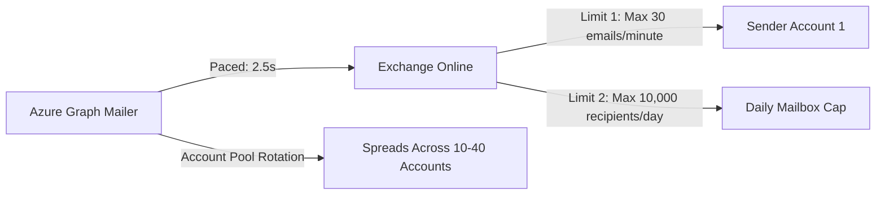

# Microsoft Graph API: Mail.Send & sendMail Specification Reference

This document provides the authoritative technical reference for integrating Microsoft Graph API for automated email dispatch, adhering strictly to the official Microsoft documentation:
- [Microsoft Graph Mail Permissions Reference](https://learn.microsoft.com/en-us/graph/permissions-reference#mail-permissions)
- [Microsoft Graph user: sendMail API Reference](https://learn.microsoft.com/en-us/graph/api/user-sendmail?view=graph-rest-1.0&tabs=http)

Related Notes:
- [[ARCHITECTURE_AND_SYSTEM_DESIGN]]
- [[COST_BREAKDOWN_AND_BUDGET]]
- [[DEPLOYMENT_GUIDE]]
- [[MULTI_ACCOUNT_WARMUP_AND_ANTI_SPAM]]

---

## 1. Mail Permissions Reference

Microsoft Graph API requires explicit permissions to dispatch emails. Because our email automation engine runs unattended 24/7 in the cloud (daemon/worker), it authenticates using OAuth 2.0 Client Credentials flow without a signed-in user.

### Delegated vs. Application Permissions

| Permission Type | Permission Name | Admin Consent Required | Use Case | How It Works |
| :--- | :--- | :--- | :--- | :--- |
| **Delegated** | `Mail.Send` | No (unless tenant policy mandates) | Interactive web apps where a human logs in via browser | Can only send on behalf of the currently logged-in user. |
| **Application** | `Mail.Send` | **YES (Mandatory)** | **Background Daemons & Queue Workers** (Our Engine) | **Allows the application to send mail as ANY user or Shared Mailbox in the entire tenant.** |

> [!IMPORTANT]
> ### Why Application Permission `Mail.Send` is Critical
> For our multi-account engine (`azure-graph-mailer`), we use **Application Permission: `Mail.Send`**.
> Once the Global Administrator clicks **"Grant admin consent for [Tenant]"** in the Azure Portal, our Node.js background worker can dynamically send emails from `account1@theparipexjournal.com`, `account2@theparipexjournal.com`, up to 40+ shared mailboxes without requiring any passwords or user logins.

---

## 2. API Endpoint Specification

### HTTP Request

```http
POST https://graph.microsoft.com/v1.0/users/{id | userPrincipalName}/sendMail
Content-Type: application/json
Authorization: Bearer <access_token>
```

- **`{id | userPrincipalName}`**: The sender mailbox email address (e.g., `editor@mail.theparipexjournal.com` or `account01@domain.com`).
- Note: In delegated mode, `POST /me/sendMail` is also supported. For background services sending across multiple accounts, `POST /users/{email}/sendMail` is strictly required.

---

## 3. Request Payload Schema

```json
{
  "message": {
    "subject": "Invitation to Submit Research Paper - Journal Paripex",
    "body": {
      "contentType": "HTML",
      "content": "<html><body><p>Dear Dr. {{Name}},</p><p>We reviewed your recent article...</p></body></html>"
    },
    "toRecipients": [
      {
        "emailAddress": {
          "address": "author@university.edu",
          "name": "Dr. John Doe"
        }
      }
    ],
    "ccRecipients": [
      {
        "emailAddress": {
          "address": "co-author@university.edu"
        }
      }
    ],
    "bccRecipients": [],
    "replyTo": [
      {
        "emailAddress": {
          "address": "editor@theparipexjournal.com",
          "name": "Editorial Office"
        }
      }
    ],
    "attachments": []
  },
  "saveToSentItems": true
}
```

### Parameter Details

| Parameter | Type | Required? | Description |
| :--- | :--- | :--- | :--- |
| `message.subject` | `String` | **Yes** | Subject line of the email. Supports merge variables. |
| `message.body.contentType` | `String` | **Yes** | Either `"HTML"` or `"Text"`. Default: `"HTML"`. |
| `message.body.content` | `String` | **Yes** | HTML or plain-text body content. |
| `message.toRecipients` | `Array` | **Yes** | Array of recipient objects with `emailAddress.address` and optional `name`. |
| `message.ccRecipients` | `Array` | No | Optional carbon copy recipients. |
| `message.bccRecipients` | `Array` | No | Optional blind carbon copy recipients. |
| `message.replyTo` | `Array` | No | Optional list of reply-to addresses. |
| `message.attachments` | `Array` | No | Optional array of base64-encoded file attachments. |
| `saveToSentItems` | `Boolean` | No | Indicates whether to save the dispatched email in the sender's "Sent Items" folder. Default is `true`. |

---

## 4. Expected HTTP Response Codes

| Status Code | Meaning | System Behavior |
| :--- | :--- | :--- |
| **`202 Accepted`** | **Success** | The email has been accepted by Microsoft Exchange Online for routing and delivery. The response body is empty. |
| **`400 Bad Request`** | **Invalid Payload** | Malformed JSON or invalid email formatting. Check recipient email syntax. |
| **`403 Forbidden`** | **Permission Denied** | App Registration is missing `Mail.Send` Application permission or Admin Consent was not granted. |
| **`404 Not Found`** | **Mailbox Missing** | `ResourceNotFound: Resource not found for the segment 'sendMail'`. This means the sender account does NOT have an active Exchange Online mailbox or license in the tenant. |
| **`429 Too Many Requests`** | **Throttled** | Sending rate exceeded (see Exchange Limits below). The response includes a `Retry-After` header. |
| **`503 Service Unavailable`** | **Transient Busy** | Temporary Exchange Online server load. The worker automatically retries. |

---

## 5. Exchange Online Sending Limits & Throttling

Microsoft Exchange Online enforces strict protections against abuse:



### Key Thresholds:
1. **Recipient Rate Limit:**
   - **10,000 recipients per day** per mailbox (for standard user mailboxes).
   - For Shared Mailboxes under a paid tenant: Microsoft allows up to **10,000 recipients/day**.
2. **Submission Quota (Message Rate Cap):**
   - **30 emails per minute per mailbox**.
   - If an account sends faster than 30 emails in 60 seconds, Microsoft returns `429 Too Many Requests`.
3. **How Our Engine Solves This:**
   - Global loop pacing: **2.5 seconds** interval (maximum 24 emails/minute globally).
   - Per-account cooldown: **60 seconds** between consecutive sends from the same sender account.
   - If a `429` occurs, our `queueWorker.js` reads the `Retry-After` header, places that specific account into cooldown, requeues the email, and rotates immediately to the next account in the pool!

---

## 6. Securing Application Permissions (Application Access Policy)

By default, granting `Mail.Send` application permission allows the app to send as *any* mailbox in the tenant. In enterprise environments where you want to restrict the app to send **only** from designated outreach mailboxes (e.g. cold mail accounts) and block it from touching executive mailboxes:

### PowerShell Commands to Scope Access:

```powershell
# 1. Connect to Exchange Online
Connect-ExchangeOnline -UserPrincipalName admin@yourdomain.com

# 2. Create a Mail-Enabled Security Group for outreach accounts
New-DistributionGroup -Name "OutreachMailboxes" -Type "Security"

# 3. Add allowed sender accounts to the group
Add-DistributionGroupMember -Identity "OutreachMailboxes" -Member "account01@yourdomain.com"
Add-DistributionGroupMember -Identity "OutreachMailboxes" -Member "account02@yourdomain.com"

# 4. Restrict App Registration to ONLY mailboxes in that group
New-ApplicationAccessPolicy `
  -AppId "172c86cf-bf4f-491d-a2dd-6d777a25e349" `
  -PolicyScopeGroupId "OutreachMailboxes@yourdomain.com" `
  -AccessRight RestrictAccess `
  -Description "Restrict Azure Graph Mailer to cold outreach accounts only"

# 5. Verify the policy works
Test-ApplicationAccessPolicy `
  -AppId "172c86cf-bf4f-491d-a2dd-6d777a25e349" `
  -Identity "account01@yourdomain.com"
```
Result: Access granted to `account01@yourdomain.com`, but blocked if attempted on personal accounts.
