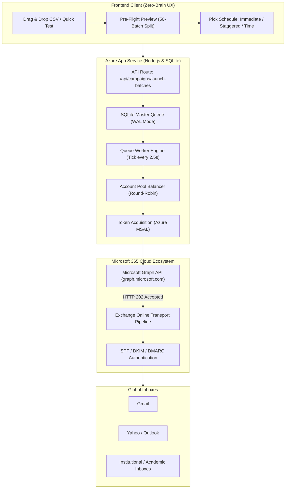

# 🚀 Azure Multi-Account Mailer: Complete Status & Scaling SOP

> **Central Reference Document**: Complete audit of all properly completed components, live production architecture, and the exact step-by-step standard operating procedure (SOP) to add and scale from 1 to 40+ sender identities.

Related Obsidian Notes:
- [[ARCHITECTURE_AND_SYSTEM_DESIGN]]
- [[M365_SHARED_MAILBOX_SETUP_GUIDE]]
- [[MULTI_ACCOUNT_WARMUP_AND_ANTI_SPAM]]
- [[COST_BREAKDOWN_AND_BUDGET]]
- [[DEPLOYMENT_GUIDE]]
- [[SPEC_PRODUCTION_CAMPAIGN_SCHEDULER]]

---

## 📊 Part 1: Completed Milestones Audit (Abhi Tak Kya Kya Proper Ho Chuka Hai)

| Category | Component | Status | Verification Detail |
| :--- | :--- | :---: | :--- |
| **Cloud Hosting** | Azure App Service (Linux B1) | ✅ PASS | Live at `https://paripex-mailer-app-fxdqc8ekgrcderdj.centralindia-01.azurewebsites.net/` |
| **CI / CD Pipeline** | GitHub Actions Automated Deployment | ✅ PASS | Any `git push origin main` triggers automated zero-downtime container build |
| **Keep-Alive Uptime** | GitHub Heartbeat Workflow | ✅ PASS | Automated cron runs every 5 minutes against `/api/health` so App Service never sleeps |
| **Database Engine** | Native Node.js SQLite (WAL Mode) | ✅ PASS | Zero native C++ dependency overhead, fast ACID transactions at `/home/data/mailer.db` |
| **API Authentication** | Microsoft Entra ID App Registration | ✅ PASS | Client ID `172c86cf-bf4f-491d-a2dd-6d777a25e349` with `Mail.Send` application consent |
| **Graph API Dispatch** | Graph Mailer Service | ✅ PASS | Tested end-to-end, returns `HTTP 202 Accepted` |
| **Multi-Account Pool** | Round-Robin Load Balancer | ✅ PASS | Automatically cycles active accounts, respects rolling 24-hr caps and cooldowns |
| **CSV Processing** | In-Memory Pre-Flight Parser | ✅ PASS | Tested with `test - new.csv` (19/19 valid contacts, 0 duplicates, 0 syntax errors) |
| **Auto-Batch Engine** | 50-Email Batch Splitter | ✅ PASS | Automatically names batches `[Sheet]_Batch_01`, `_Batch_02` to protect sender reputation |
| **Scheduling Modes** | 3-Mode Dispatch Scheduler | ✅ PASS | Immediate Dispatch, Specific Future Date/Time, or Staggered Interval between batches |
| **Frontend UX** | Zero-Cognitive Dashboard Redesign | ✅ PASS | 3-card Quick Action Hub, Quick Test Email modal, 1-Click sample CSV download, 4-step wizard |
| **DNS Configuration** | Domain Authentication | ✅ PASS | MX pointed to Microsoft Exchange, SPF configured with `include:spf.protection.outlook.com` |

---

## 🏗️ Part 2: Complete End-to-End Architecture Flow

---

## 📋 Part 3: Exact SOP — How to Add More Email IDs (Scaling to 40+ Accounts)

To scale from 1 mailbox to 5, 10, 20, or 40 accounts for cold outreach, follow this exact standard procedure:

### Step 1: Create the New Mailbox in M365
1. Go to **[admin.microsoft.com](https://admin.microsoft.com)** $\to$ **Teams & groups** $\to$ **Shared mailboxes** (or **Active users**).
2. Click **+ Add a shared mailbox**.
3. Name: e.g. `Editorial Office 02`
4. Email: `editor02@theparipexjournal.com` (select `@theparipexjournal.com`).
5. Click **Save changes**.

> [!TIP]
> Naming convention recommended:
> - `dr.reetashah@theparipexjournal.com`
> - `editor.paripex@theparipexjournal.com`
> - `submissions@theparipexjournal.com`
> - `review.desk@theparipexjournal.com`
> - `desk01@theparipexjournal.com` ... up to `desk40@theparipexjournal.com`

---

### Step 2: Grant Send-As Permissions to Your Admin Account
1. Click on the newly created mailbox in the shared mailboxes list.
2. In the right flyout, under **Members**, click **Edit** $\to$ Add your Admin user (`Hamza Memon`).
3. Under **Send as permissions**, click **Edit** $\to$ Add your Admin user.
4. *(Optional)* Under **Read and manage**, add your Admin user so you can view its inbox in Outlook Web anytime.

---

### Step 3: Ensure Outbound External Relay is Allowed
Ensure the mailbox is licensed (Exchange Online Plan 1) OR an outbound connector/anti-spam policy exception is enabled so Exchange Online routes emails to `@gmail.com` without NDR bounces.

---

### Step 4: Register the Account in Your Mailer Dashboard
1. Open your live mailer dashboard:
   `https://paripex-mailer-app-fxdqc8ekgrcderdj.centralindia-01.azurewebsites.net/`
2. Click the **👥 Sender Accounts Pool** tab.
3. In **Add / Update Sender Account**:
   - **Sender Email Address**: `editor02@theparipexjournal.com`
   - **Display Name**: `Journal Paripex - Editorial Office`
   - **Daily Limit**: `500` (Use `25-50` for week 1 warmup)
   - **Cooldown**: `60` seconds
   - **Dispatch Engine**: `Microsoft Graph API (Default)`
4. Click **➕ Add Account to Pool**.

---

### Step 5: Verification Test
1. Click the **⚡ Quick Test Email** button in the header.
2. Enter your test email (`checkingm13@gmail.com`).
3. Click **🚀 Send Test Now**.
4. Confirm message lands in inbox!

---

## 📈 Part 4: Capacity Scaling Table (1 to 40 Accounts)

| Active Accounts in Pool | Safe Warmup Daily (Week 1) | Full Production Capacity (Daily) | Monthly Sending Capacity |
| :---: | :---: | :---: | :---: |
| **1 Account** | 25 emails / day | 500 emails / day | 15,000 emails / month |
| **5 Accounts** | 125 emails / day | 2,500 emails / day | 75,000 emails / month |
| **10 Accounts** | 250 emails / day | 5,000 emails / day | 150,000 emails / month |
| **20 Accounts** | 500 emails / day | 10,000 emails / day | 300,000 emails / month |
| **40 Accounts** | 1,000 emails / day | 20,000 emails / day | 600,000 emails / month |

*(The built-in Round-Robin algorithm automatically distributes all uploaded CSV batches evenly across all registered accounts in the pool).*
