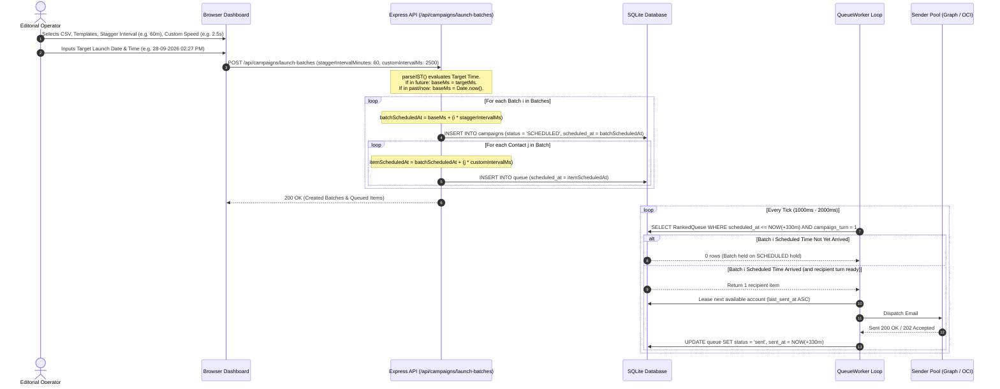

# ⏱️ Technical Specification: Production Campaign Scheduling & Real-Time Monitor

**Target System:** `azure-graph-mailer`  
**Author:** Antigravity Engineering  
**Status:** PRODUCTION IMPLEMENTED & VERIFIED  
**Date:** September 17, 2026  

---

## 1. Goal & Requirements Overview

The campaign scheduling engine orchestrates multi-account, high-throughput delivery across Indian academic journals with:
1. **Multi-Account Leasing & Auto-Fallback:** Primary sender pinning with automatic round-robin fallback across healthy pool mailboxes if the pinned sender is busy, throttled, or reaches its daily limit.
2. **Strict Indian Standard Time (IST) Normalization:** All user schedules, execution queries, and database logs operate anchored to `Asia/Kolkata` (`UTC+05:30`).
3. **Instant Send-Now Priority Engine:** 1-Click "Send Now" trigger with reactive worker wakeup (`0ms` polling delay), top-tier queue rank ordering, and 100ms ultra-fast pacing.
4. **Pre-Flight Projected Schedule Timeline:** Preview modal computes projected start and completion times per batch before launch.
5. **Deterministic Batch Chaining:** Automatic sequential execution of multi-batch series (`Batch_01` $\to$ `Batch_02` $\to$ `...`) isolated strictly by campaign series prefix.
6. **Live Frontend Campaign Monitor:** Hero card with real-time progress bar, dynamic ETA, and 1-Click Pause/Resume/Cancel controls.

---

## 2. Database Schema Definition

### Table: `campaigns`
- `id INTEGER PRIMARY KEY AUTOINCREMENT`
- `name TEXT NOT NULL`: E.g., `17-9-26-campaign01_Batch_01`.
- `parent_id INTEGER`: Links child batches to parent series.
- `template_id INTEGER NOT NULL REFERENCES templates(id)`
- `status TEXT DEFAULT 'SCHEDULED'`: `SCHEDULED`, `QUEUED`, `RUNNING`, `PAUSED`, `COMPLETED`, `CANCELLED`.
- `total_count INTEGER DEFAULT 0`
- `sent_count INTEGER DEFAULT 0`
- `failed_count INTEGER DEFAULT 0`
- `scheduled_at DATETIME`: Target execution timestamp in IST (`YYYY-MM-DD HH:mm:ss`).
- `started_at DATETIME`: Time first email dispatched in IST.
- `completed_at DATETIME`: Time last email dispatched in IST.
- `pinned_account_id INTEGER REFERENCES accounts(id)`: Preferred sender mailbox.
- `fallback_allowed INTEGER DEFAULT 1`: Permits automatic pool leasing when pinned account is saturated.
- `custom_interval_ms INTEGER DEFAULT 2500`

### Table: `queue`
- `id INTEGER PRIMARY KEY AUTOINCREMENT`
- `campaign_id INTEGER NOT NULL REFERENCES campaigns(id)`
- `contact_id INTEGER REFERENCES contacts(id)`
- `email TEXT NOT NULL`
- `name TEXT`
- `subject TEXT NOT NULL`
- `rendered_html TEXT NOT NULL`
- `status TEXT DEFAULT 'queued'`: `queued`, `sending`, `sent`, `failed`.
- `account_id INTEGER REFERENCES accounts(id)`: Leased sender account.
- `scheduled_at DATETIME`: Eligible execution time in IST. `NULL` denotes immediate dispatch.
- `sent_at DATETIME`: Dispatch timestamp in IST.
- `accepted_at DATETIME`: Upstream provider acceptance timestamp in IST.
- `attempts INTEGER DEFAULT 0`
- `last_error TEXT`
- `provider_message_id TEXT`

---

## 3. Queue Worker Scheduler Engine (`src/services/queueWorker.js`)

### 3.1 Priority Queue Selection Query (IST Anchored)
### 3.1 Priority Queue Selection Query (IST Anchored with Pacing Guard)
To prevent parallel account collisions and enforce strict per-recipient sequential pacing across regular campaigns, the worker selects queue items using a window-partitioned CTE (`campaign_turn = 1`):

```sql
WITH RankedQueue AS (
  SELECT q.*, c.name AS campaign_name, c.status AS campaign_status,
         c.mode AS campaign_mode,
         COALESCE(c.pinned_account_id, c.sender_account_id) AS campaign_pinned_account_id,
         c.fallback_allowed AS campaign_fallback_allowed,
         c.custom_interval_ms AS campaign_custom_interval_ms,
         ROW_NUMBER() OVER (PARTITION BY q.campaign_id ORDER BY q.scheduled_at ASC, q.id ASC) AS campaign_turn
  FROM queue q
  JOIN campaigns c ON q.campaign_id = c.id
  WHERE q.status = 'queued'
    AND (q.scheduled_at IS NULL OR q.scheduled_at <= datetime('now', '+330 minutes'))
    AND c.status IN ('SCHEDULED', 'QUEUED', 'RUNNING')
)
SELECT * FROM RankedQueue
WHERE (campaign_turn = 1 OR campaign_id IN (:priorityIds))
ORDER BY 
  CASE 
    WHEN campaign_id IN (:priorityIds) THEN 0 
    WHEN campaign_status = 'RUNNING' THEN 1 
    ELSE 2 
  END ASC,
  CASE WHEN scheduled_at IS NULL THEN 0 ELSE 1 END ASC,
  scheduled_at ASC,
  id ASC
LIMIT :concurrency;
```

> [!IMPORTANT]
> - **Regular Campaigns (`campaign_turn = 1`)**: Exactly **one email per regular campaign** is processed in each worker tick. This enables the available accounts in the pool to rotate naturally (`last_sent_at ASC`) without firing 5–10 emails simultaneously.
> - **Priority Instant Send Bypass (`campaign_id IN (:priorityIds)`)**: Triggered by user 1-Click "Send Now", this bypasses the turn restriction to unleash full multi-account parallel throughput.

---

## 4. Staggered Batches & Production Request Flow



### 4.1 Dispatch Timing Calculations

1. **Target Launch Time vs Immediate Start**:
   - `scheduleMode === 'immediate'`: Base start time is `Date.now()`.
   - `scheduleMode === 'scheduled' || 'staggered'`: Evaluated via `parseIST(scheduledDateTimeIST)`.
   - If the user-specified time has already elapsed (`parsed <= Date.now()`), the system safely falls back to `baseMs = Date.now()`. If future, `baseMs = parsedMs`.

2. **Batch Staggering Formula**:
   $$\text{batchScheduledAt}_i = \text{baseMs} + (i \times \text{batchStaggerIntervalMinutes} \times 60{,}000)$$
   - `Batch_01` begins at $\text{baseMs}$.
   - `Batch_02` remains on hold until $\text{baseMs} + 60\text{ min}$.
   - `Batch_03` remains on hold until $\text{baseMs} + 120\text{ min}$.

3. **Per-Recipient Granular Timestamp Staggering**:
   $$\text{itemScheduledAt}_{i, j} = \text{batchScheduledAt}_i + (j \times \text{customIntervalMs})$$
   - Recipient #1 is eligible at $\text{batchScheduledAt}_i + 0\text{s}$.
   - Recipient #2 is eligible at $\text{batchScheduledAt}_i + 2.5\text{s}$.
   - Recipient #3 is eligible at $\text{batchScheduledAt}_i + 5.0\text{s}$.

---

## 5. API Endpoints

1. `POST /api/campaigns/:id/send-now`:
   - Recursively targets campaign and child batches (`parent_id = :id` OR `name LIKE ':name_Batch_%'`).
   - Clears `scheduled_at = NULL` and marks campaigns `RUNNING`.
   - Invokes `queueWorker.triggerInstantSend(targetIds)`: adds IDs to `priorityCampaignIds` and calls `wake()`.
2. `POST /api/campaigns/:id/pause`: Pauses campaign (`status = 'PAUSED'`).
3. `POST /api/campaigns/:id/resume`: Resumes paused campaign (`status = 'RUNNING'`).
4. `POST /api/campaigns/:id/cancel`: Cancels campaign and marks pending queue items as `failed`.
5. `POST /api/campaigns/bulk-action`: Bulk executes `PAUSED`, `RESUMED`, or `CANCELLED` across multiple campaign IDs.
6. `GET /api/campaigns/active-monitor`: Returns active campaign telemetry, ETA, sender health, and upcoming batches.

---

## 6. Pacing & Concurrency Controls

- **Worker Concurrency**: 10 concurrent dispatches per loop tick (managed via `worker_concurrency` setting, capped at 20).
- **Dual Pacing Modes**:
  - **Priority Instant Send**: `100ms` sleep between loop ticks when priority campaigns are active.
  - **Normal Pacing**: `Math.max(500, Math.min(sendIntervalMs, 2000))` (500ms–2000ms) to maintain healthy sender reputation.
- **Interruptible Sleep**: Uses `interruptibleSleep(ms)` allowing `queueWorker.wake()` to break the sleep timer instantaneously.

---

## 7. Batch Chain Manager Specification

- **Naming Convention**: `${baseCampaignName}_Batch_${batchNumber}` (e.g., `17-9-26-campaign01_Batch_01`).
- **Strict Series Isolation**: Queries next batch using `${baseName}_Batch_${nextBatchStr}`.
- **Auto-Reconciliation**: If tail items experience persistent clock-skew or auth errors, watchdog auto-fails them and marks campaign `COMPLETED` once `(sent + failed) >= total_count`.

---

## 🔗 Related Notes (Obsidian Links)
* [[INCIDENT_REPORT_DISPATCH_PACING_PARALLEL_BURST_AND_RECIPIENT_STAGGER]]
* [[UI_DESIGN_SYSTEM_AND_LIGHT_THEME_SPECIFICATION]]
* [[ALGORITHM_TIMING_SCHEDULING_AND_WORKERS_DSA]]
* [[ARCHITECTURE_AND_SYSTEM_DESIGN]]
* [[INCIDENT_REPORT_QUEUE_FREEZE_IST_TIMEZONE_AND_SEND_NOW_AUDIT]]
* [[DEPLOYMENT_GUIDE]]
* [[README]]
